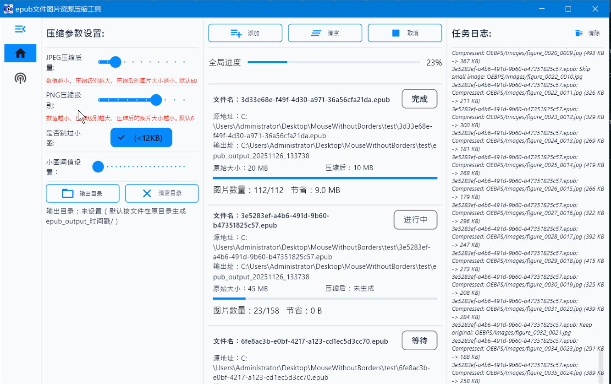

# EPUB 图片资源压缩工具

基于 Flutter 的桌面应用，支持在 Windows 上批量压缩 EPUB 内部的图片资源，在保持清晰度和原始结构的前提下尽可能减小体积，并生成结构一致的新 EPUB 文件。

## 功能概览
- 批量压缩：保持图片名称、路径、格式不变，输出目录可自选或自动生成。
- 压缩策略：JPEG 质量可调（默认 85），PNG 可调压缩等级，小图可按阈值跳过，WebP 保留原图。
- 过程体验：全局进度 + 单文件进度，实时日志流，支持取消任务。
- 结果输出：输出目录统一使用原文件名，自动创建 `/` 目录（或自定义路径）。

## 开发与运行
- 获取依赖：`flutter pub get`
- 运行调试：`flutter run -d windows`（或选择可用设备）
- 分析代码：`flutter analyze`
- 执行测试：`flutter test`

## 使用指引
1. 启动应用，进入“压缩”页。
2. 单文件模式：选择 EPUB、设置输出目录（可选）、调整质量参数，点击“开始压缩”。
3. 批量模式：添加多个 EPUB，设置统一输出目录，点击“批量开始”。可随时“取消全部”。
4. 在底部“任务流”查看实时日志与结果提示。

## 目录结构
- `lib/pages/compress/`：压缩主界面、控制器与状态。
- `lib/service/epub_compressor.dart`：EPUB 解压、图片压缩与重新打包的核心逻辑。
- `lib/routers/`：路由与中间件。
- `assets/images/`：启动页/占位图资源目录（可自行替换）。

更多需求细节可见 `records/demand.md`。*** End Patch

支持作者：

- 